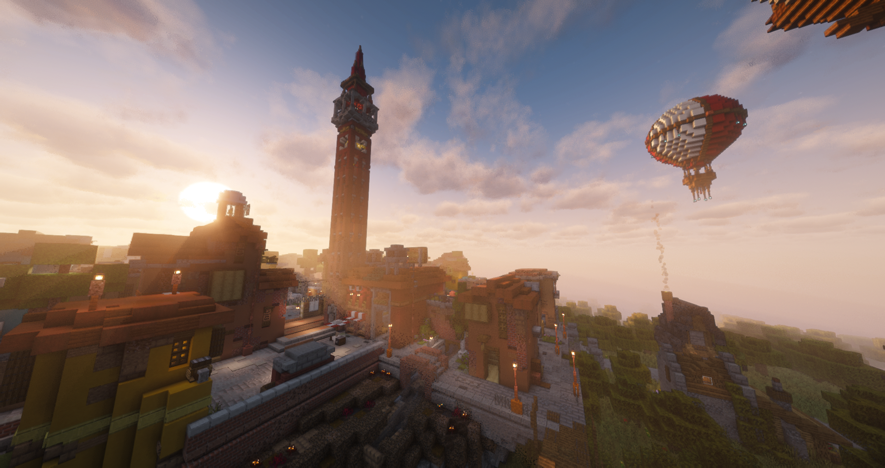

# Первое знакомство

## **Спавн**

<figure><figcaption></figcaption></figure>

На спавне расположены разные NPC и подсказки к началу игры, а так же кликабельные голограммы, чтобы не потерять полезные ссылки.

Если по ходу игры Вам потребуется вернуться на спавн, то достаточно прописать команду <mark style="color:$primary;">/spawn</mark>

***

## Проводник

<figure><figcaption></figcaption></figure>

Кликнув по NPC, откроется меню, в котором можно выбрать несколько опций:

* Открытие меню городов, у которых включен свободный спавн
* Случайная телепортация
* Открытие меню городов со свободным вступлением

<figure><figcaption></figcaption></figure>

***

## Торговец

<figure><figcaption></figcaption></figure>

Подойдя и нажав по торговцу, откроется меню <mark style="color:$primary;">/donate</mark>, где можно купить:

### <mark style="color:$primary;">Ключи от кейсов</mark>

Можно купить ключ от <mark style="color:$primary;">любого из 5ти доступных кейсов</mark> на данный момент

<mark style="color:$primary;">Доступные кейсы:</mark>

* Случайный шаблон для брони
* Случайный ресурс
* Всё или ничего
* Случайный префикс
* Случайный спавнер


Подробнее о шансах выпадения и более подробный ассортимент можно найти здесь - [keisy.md](keisy.md "mention")


### Сброс религии

Сбрасывает текущую религию для города и позволяет выбрать новую!

Для того, чтобы сменить религию, <mark style="color:$primary;">покупка должна быть осуществлена главой города</mark>, где уже выбрана религия


Информацию о доступных городу религиях можно найти здесь - [#religii](../../goroda/gorodskie-komandy/razvitie-goroda.md#religii "mention")


### Сброс формы правления

Сбрасывает текущую форму правления для города и позволяет выбрать новую!

Для того, чтобы сменить форму правления, <mark style="color:$primary;">покупка должна быть осуществлена главой города</mark>, где уже выбрана религия


Информацию о доступных городу формах правления можно найти здесь - [#formy-pravleniya](../../goroda/gorodskie-komandy/razvitie-goroda.md#formy-pravleniya "mention")


***

## Книга новичка

По команде <mark style="color:$primary;">/guide</mark> мы подготовили небольшое руководство с основными командами, которые могут помочь с  освоением сервера!

В книге есть руководство для начинающих, а следующие разделы - "Житель" и "Глава города" будут доступны после вступления/создания города

<figure><figcaption></figcaption></figure>

***

## Карта сервера

Откройте карту сервера, чтобы увидеть все существующие города, а так же доступную информацию о них. На ней как раз можно выбрать идеальное место для будущего города, или поискать перспективный город для более мощного старта!

На карте так же присутствуют все основные строения из ванильного майнкрафта, в том числе деревни, храмы испытаний, крепости!

<figure><figcaption></figcaption></figure>

Карта доступна по ссылке:


<mark style="color:yellow;">Если по каким-то причинам не получается зайти на сайт, попробуйте зеркало -</mark> [<mark style="color:yellow;">map.espolit.online</mark>](https://map.espolit.online/)



Разработчиками карты так же являемся мы! Поэтому перед каждым вайпом можно ожидать различные обновления и исправления недочётов!

