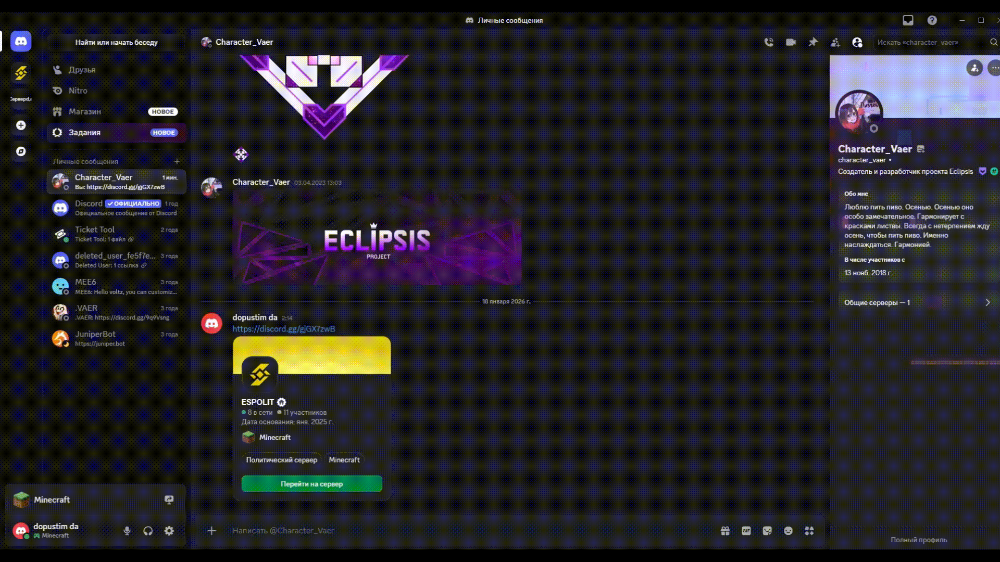

---
layout:
  width: default
  title:
    visible: true
  description:
    visible: false
  tableOfContents:
    visible: true
  outline:
    visible: true
  pagination:
    visible: true
  metadata:
    visible: false
  tags:
    visible: true
  actions:
    visible: true
---

# Помощь по игре

## Стартовое руководство

Чтобы открыть стартовое руководство на сервере, пропишите команду /guide

После ввода, откроется меню, где вы можете выбрать доступный раздел, на данный момент их три:

* <mark style="color:$primary;">Новичок</mark> - руководство для только пришедших игроков
* <mark style="color:$primary;">Житель</mark> - руководство для тех, кто вступил в город
* <mark style="color:$primary;">Мэр</mark> - руководство для глав города

В каждом руководстве, в конце текста есть кнопка <mark style="color:$success;">\[Завершить]</mark>, нужно на неё нажать, чтобы руководство зачлось как прочитанное. За прочтение каждого руководства будет выслана награда!

После прочтения каждого руководства в разделе, Вам будет выслана дополнительная награда которая обязательно поможет Вам в освоении! <mark style="color:$primary;">Награду можно получить только один раз!</mark>

<figure><figcaption></figcaption></figure>

***

## Поддержка внутри игры

На сервере так же можно написать администрации о возможных трудностях и если хотите получить поддержку!

Для этого, нужно прописать команду <mark style="color:$primary;">/helpop <сообщение></mark>.&#x20;

<figure><figcaption></figcaption></figure>

После, Вашему обращению будет присвоено ID и создаётся тикет, который будут рассматривать администраторы и хелперы нашего сервера!

<figure><figcaption></figcaption></figure>

Чтобы посмотреть Ваши обращения, дополнить их, удалить, введите команду <mark style="color:$primary;">/helpop list</mark>, и в чате откроется меню с выбором нужного обращения

<figure><figcaption></figcaption></figure>

Выберите любое обращения и Вам откроется история переписки. В переписке сохранены последние 5 сообщений, тема обращения и меню действий.

<figure><figcaption></figcaption></figure>

Всего можно зарегистрировать <mark style="color:$primary;">до 3х активных обращения одновременно</mark>


Если возникли недопонимания или жалобы на администрацию, просим писать в наш Discord!


***

## Поддержка на сервере Discord

Всё просто! Чтобы подать тикет в поддержку, нужно



#### Зайти на сервер <mark style="color:$primary;">ESPOLIT</mark> по ссылке





#### Найти канал <mark style="color:$primary;">"Поддержка"</mark>

Он находится в самом верху, в категории <mark style="color:$primary;">"Общее"</mark>

<figure><figcaption></figcaption></figure>



#### Выбрать тему обращения

<mark style="color:$primary;">Это важно!</mark> Так как рассматривать тикет на определённую тему могут разные должности!

<figure><figcaption></figcaption></figure>



#### Заполнить небольшую анкету

Так администрации будет проще структуризовать информацию

<figure><figcaption></figcaption></figure>



#### Ожидать ответа администрации

Мы отвечаем на запросы <mark style="color:$primary;">с 11:00 до 21:00</mark> по Московскому времени

<figure><figcaption></figcaption></figure>



### Видеоинструкция

<figure><figcaption></figcaption></figure>
