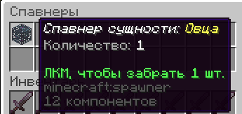

# Спавнера

## Меню спавнеров

Если вы выбили спавнер из кейса, или купили его на нашем сайте, спавнер не попадёт в инвентарь, но забрать его можно по команде <mark style="color:$primary;">/spawners</mark>&#x20;

<figure><figcaption></figcaption></figure>

В меню можно забрать все полученные спавнера. Эти полученные спавнера привязываются к владельцу, то есть, если их разрушить, то <mark style="color:$primary;">спавнер не выпадет игроку, а попадёт напрямую в данное меню.</mark>&#x20;

### Вспомогательные команды:

Привязка к владельцу обеспечивает в том чисте и то, что владелец сможет всегда их отследить и вернуть независимо от ситуаций:

* <mark style="color:$primary;">/spawners pos <Тип спавнера></mark> - Посмотреть расположение спавнеров на карте
* <mark style="color:$primary;">/spawners reset</mark> - Вернуть все спавнера в меню. То есть, спавнера удалятся с карты и вернутся владельцу
